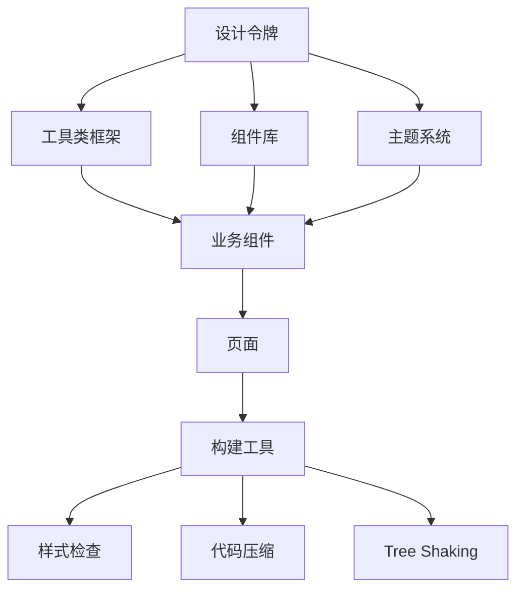
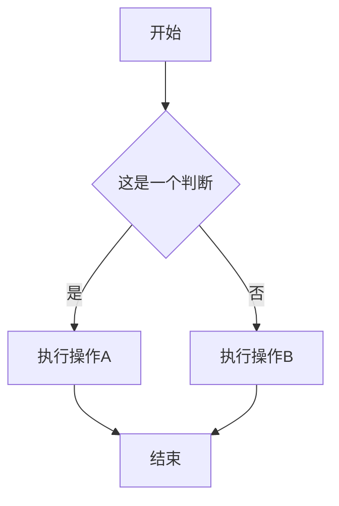

## 隐藏元素的方法有哪些？

### 1. display: none

```css
.hidden {
  display: none;
}
```

- **原理**：完全从文档流中移除元素，不占据任何空间
- **特点**：
  - 元素不占据空间
  - 不响应事件
  - 屏幕阅读器不读取
  - 不参与页面布局计算
- **使用场景**：需要完全移除元素且不需要其占据空间的情况

### 2. visibility: hidden

```css
.invisible {
  visibility: hidden;
}
```

- **原理**：元素不可见但仍占据文档流中的空间
- **特点**：
  - 元素保持原有空间
  - 不响应事件
  - 屏幕阅读器通常不读取
  - 子元素可通过设置 visibility: visible 重新显示
- **使用场景**：需要隐藏元素但保留其占据空间的情况

### 3. opacity: 0

```css
.transparent {
  opacity: 0;
}
```

- **原理**：将元素透明度设置为 0，使其完全透明
- **特点**：
  - 元素保持原有空间
  - 默认仍能响应事件
  - 屏幕阅读器会读取内容
  - 可以配合 transition 实现平滑过渡效果
- **使用场景**：需要实现淡入淡出效果或暂时隐藏但保持可交互性的情况

### 4. position: absolute + 偏移

```css
.offscreen {
  position: absolute;
  left: -9999px;
  top: -9999px;
}
```

- **原理**：将元素移出可视区域
- **特点**：
  - 元素从文档流中移除，但仍存在于 DOM 中
  - 可配合 z-index 控制层级
  - 屏幕阅读器可能会读取内容
- **使用场景**：需要隐藏元素但保留其可访问性的情况，如屏幕阅读器优化

### 5. clip-path

```css
.clip {
  clip-path: polygon(0 0, 0 0, 0 0, 0 0);
  /* 或使用更现代的语法 */
  clip-path: circle(0);
}
```

- **原理**：通过裁剪路径将元素裁剪为不可见区域
- **特点**：
  - 元素保持原有空间
  - 可创建复杂的裁剪动画
  - 现代浏览器支持良好
- **使用场景**：需要实现复杂裁剪动画或精确控制可见区域的情况

### 6. transform: scale(0) 或 transform: translateX/Y(-9999px)

```css
.scaled {
  transform: scale(0);
}

.translated {
  transform: translateX(-9999px);
}
```

- **原理**：通过变形属性改变元素的可见性
- **特点**：
  - scale(0)不会占据空间，但元素本身仍在原位
  - 性能较好，触发 GPU 加速
  - 可配合 transition 实现平滑过渡
- **使用场景**：需要高性能动画或特殊变形效果的隐藏方式

### 7. height: 0; width: 0; overflow: hidden

```css
.collapsed {
  height: 0;
  width: 0;
  overflow: hidden;
}
```

- **原理**：将元素尺寸设置为 0 并隐藏溢出内容
- **特点**：
  - 元素不占据空间
  - 内容被截断但仍在 DOM 中
  - 可用于实现折叠效果
- **使用场景**：需要彻底隐藏内容并释放空间的情况

### 8. pointer-events: none

```css
.unclickable {
  opacity: 0;
  pointer-events: none;
}
```

- **原理**：使元素对鼠标事件无响应
- **特点**：
  - 通常与其他隐藏方法结合使用
  - 元素可见性不变，但不可交互
- **使用场景**：需要元素可见但不可点击的情况

### 9. aria-hidden="true"

```html
<div aria-hidden="true">这个内容对屏幕阅读器隐藏</div>
```

- **原理**：通过 ARIA 属性告诉辅助技术忽略该元素
- **特点**：
  - 只影响可访问性，不影响视觉呈现
  - 需要与其他视觉隐藏方法配合使用
- **使用场景**：需要优化可访问性，隐藏辅助技术不需要读取的内容

### 各方法对比总结

| 方法                    | 占据空间 | 响应事件 | 屏幕阅读器 | 适用场景     |
| ----------------------- | -------- | -------- | ---------- | ------------ |
| display: none           | 否       | 否       | 否         | 完全移除     |
| visibility: hidden      | 是       | 否       | 否         | 保留空间     |
| opacity: 0              | 是       | 是       | 是         | 透明交互     |
| position: absolute 偏移 | 否       | 是       | 可能       | 可访问性隐藏 |
| clip-path               | 是       | 部分     | 是         | 裁剪动画     |
| transform: scale(0)     | 否       | 否       | 是         | 变形动画     |
| height:0+width:0        | 否       | 否       | 是         | 内容截断     |
| pointer-events: none    | 不变     | 否       | 不变       | 禁用交互     |
| aria-hidden             | 不变     | 不变     | 否         | 辅助技术     |

### 应用场景：

1. 响应式设计中，根据不同屏幕尺寸隐藏或显示元素。

- 示例：在移动设备上隐藏导航菜单，显示菜单图标。

```css
@media screen and (max-width: 768px) {
  .hidden-on-mobile {
    display: none;
  }
}
```

2. 交互组件状态管理
   2.1 tab 切换时，隐藏未选中的内容。
   - 示例：在选项卡切换时，隐藏未选中的内容区域。
   ```css
   .tab-content {
     display: none;
   }
   .tab-content.active {
     display: block;
   }
   ```
   2.2 模态框或弹窗关闭时，隐藏其内容。
   - 示例：在点击关闭按钮后，隐藏模态框的内容区域。
   ```css
   .modal-content {
     display: none;
   }
   .modal-content.active {
     display: block;
   }
   ```
   2.3 下拉菜单的显示与隐藏。
   - 示例：在点击下拉菜单触发按钮后，显示下拉菜单的内容。
   ```css
   .dropdown-content {
     display: none;
   }
   .dropdown-content.active {
     display: block;
   }
   ```
3. 可访问性优化

- 示例：在屏幕阅读器优化中，隐藏辅助内容但保留其可访问性。

```css
.sr-only {
  position: absolute;
  left: -9999px;
  top: -9999px;
}
```

6. SEO 优化。

- 示例：在搜索结果中隐藏一些不相关的内容，提高排名。

```css
.hidden-on-search {
  display: none;
}
```

7. 京东 logo 部分：隐藏文本内容

```html
<style>
  #logo {
    position: absolute;
    z-index: 2;
    left: 0;
    top: 32px;
    width: 240px;
    height: 70px;
  }
  .logo_tit {
    position: absolute;
    width: 100%;
    height: 100%;
  }

  .logo_tit_lk {
    background-repeat: no-repeat;
    overflow: hidden;
    display: block;
    width: 240px;
    height: 70px;
    font-size: 0; /* 隐藏文本 */ /* [!code highlight]*/
  }

  .logo_subtit {
    display: none;
  }

  .logo_extend {
    display: none;
    position: absolute;
    width: 100%;
    height: 100%;
  }
</style>

<body>
  <div id="logo" class="logo">
    <h1 class="logo_tit">
      <a
        href="//www.jd.com"
        class="logo_tit_lk"
        clstag="h|keycount|h|keycount|head|logo_01"
        >京东</a
      >
    </h1>
    <h2 class="logo_subtit">京东,多快好省</h2>
    <div
      class="logo_extend"
      clstag="h|keycount|h|keycount|head|logo_02"
      style="display: block;"
    >
      <a
        id="J_logo_extend"
        href="https://www.jd.com/"
        target="_blank"
        aria-label="大促LOGO位推广"
        style="display: block; width: 240px; height: 70px;"
        ></a>
    </div>
  </div>
</body>
```

- 京东首页，logo 部分的实现。
- 使用 `font-size: 0` 隐藏文本，通过 CSS 背景图显示 Logo 图片
- 保持 HTML 语义化和 SEO 友好

8. 淘宝 logo 部分的实现：隐藏文本内容

```html
<style>
  .logo,
  .tbh-logo {
    float: left;
    height: 72px;
    width: 240px;
  }

  .logo h1,
  .tbh-logo h1 {
    position: relative;
  }

  .logo h1 .logo-bd,
  .tbh-logo h1 .logo-bd {
    background-position: 50%;
    background-size: contain;
    display: block;
    height: 0; /* 高度设为0 */ /*[!code highlight]*/
    overflow: hidden; /* 隐藏溢出内容 */ /*[!code highlight]*/
    padding-top: 72px; /* 用padding撑开高度 */ /* [!code highlight]*/
    text-indent: -9999px; /* 将文字推到屏幕外 */ /* [!code highlight]*/
    width: 240px;
  }

  .logo h1 img,
  .tbh-logo h1 img {
    display: block;
    height: 110px;
    width: 230px;
  }

  .logo h2,
  .tbh-logo h2 {
    display: none;
  }

  .logo h2 a,
  .tbh-logo h2 a {
    background-position: 50%;
    background-repeat: no-repeat;
    background-size: contain;
    display: block;
    height: 0;
    overflow: hidden;
    padding-top: 42px;
    text-indent: -9999px; /*[!code highlight]*/
    width: 240px;
  }

  .logo .logo-hover,
  .tbh-logo .logo-hover {
    position: absolute;
    top: -51px;
    z-index: 30;
  }

  .logo .logo-hover img,
  .tbh-logo .logo-hover img {
    position: relative;
  }

  .logo .logo-img,
  .tbh-logo .logo-img {
    height: 72px;
    width: 240px;
  }

  .tbh-logo {
    height: auto;
  }
</style>
...
<body>
  <div class="tbh-logo" data-name="logo" data-spm="201857">
    <div class="logo">
      <h1>
        <a
          href="https://www.taobao.com/"
          role="img"
          class="logo-bd clearfix"
          style='background-image: url("https://img.alicdn.com/imgextra/i1/O1CN011YZ3P01zMCE6HGyhk_!!6000000006699-2-tps-480-144.png");'
          >淘宝网</a
        >
      </h1>
      <h2 arial-hidden="true">
        <a
          href="https://www.taobao.com/"
          role="img"
          class="clearfix"
          style='background-image: url("https://img.alicdn.com/imgextra/i1/O1CN011YZ3P01zMCE6HGyhk_!!6000000006699-2-tps-480-144.png");'
          >淘宝网</a
        >
      </h2>
    </div>
  </div>
</body>
```

- 淘宝首页 logo 文字隐藏
- 使用 `text-indent: -9999px` 将文本内容推出到可视区域外
- CSS 背景图方式显示 Logo，便于响应式控制

9. 对比京东和淘宝在 logo 实现上的差异：

| 特性     | 淘宝方法               | 京东方法          |
| -------- | ---------------------- | ----------------- |
| 文字隐藏 | text-indent: -9999px   | font-size: 0      |
| 图片显示 | CSS 背景图             | 标签         |
| 高度控制 | height:0 + padding-top | 直接设置 height   |
| SEO 优化 | ✅ 文字在 HTML 中      | ✅ 文字在 HTML 中 |
| 可访问性 | ✅ 屏幕阅读器可读      | ✅ 屏幕阅读器可读 |

## 盒模型

- 盒模型的组成：内容区域（content）、内边距（padding）、边框（border）、外边距（margin）
  

- 外边距不计入盒子的实际大小——当然，它影响盒子在页面上所占的总空间，但只影响盒子外的空间。
- 盒子的面积止于边框，不会延伸到外边距中。

- 盒模型分为标准盒模型和怪异盒模型
  - 标准盒模型：宽度和高度只包含内容区域，不包含内边距、边框和外边距。
  - 怪异盒模型：宽度和高度包含内容区域、内边距、边框和外边距。

## 替换元素的概念及计算规则

常见的替换元素有：``、`<video>`、`<audio>`、`<iframe>`、`<object>` 等。

- 替换元素的宽度和高度由其内容决定，而不是由 CSS 样式设置的宽度和高度。
- 替换元素的外边距和内边距也会影响其在页面上的位置。

## CSSSprites 的理解

CSS 精灵图，也叫 CSS 雪碧图，是一种将多个小图片合并到一张大图中的技术。通过设置背景位置（background-position）来显示不同的图片。

### 实现原理

- 将多个小图片合并到一张大图中。
- 使用 CSS 背景图属性（background-image）指定大图的路径。
- 使用 background-position 定位特定图标
- 设置合适的 width 和 height 显示图标区域

### 优势

- 减少 HTTP 请求次数，提高页面加载速度。
- 减少图片文件大小，节省带宽。

### 缺点

- 维护相对困难
- 需要精确计算位置
- 在现代 Web 开发中，**SVG 图标和图标字体是替代方案**

### 总结

- 精灵图及其主要替代方案的特点：

| 技术/方案                                                      | 当前地位                                                       | 核心原理                                                | 主要优势                                 | 典型场景                                   |
| -------------------------------------------------------------- | -------------------------------------------------------------- | ------------------------------------------------------- | ---------------------------------------- | ------------------------------------------ |
| CSS Sprites（精灵图）                                          | 特定场景优化                                                   | 多张小图合并成一张大图，通过 CSS 背景定位显示           | 减少 HTTP 请求，预加载 hover 状态无闪烁  | 静态网站、大量小图标且不常变更的项目       |
| SVG Sprite                                                     | 现代主流选择                                                   | 多个 SVG 图标合并到一个 SVG 文件，使用`<use>`引用       | 矢量缩放不失真，CSS 控制样式灵活，文件小 | 高清屏、响应式设计、需要动态调整颜色的图标 |
| Icon Font（图标字体）                                          | 仍有使用                                                       | 将图标制作成字体文件，通过字符代码引用                  | 加载快、无限缩放、颜色可控               | 简单图标库，如 Font Awesome                |
| HTTP/2                                                         | 底层协议革新                                                   | 允许在单个 TCP 连接上并行传输多个请求和响应（多路复用） |
| 降低了大量小文件请求的开销，使得为每个图标单独发请求的成本变低 | 所有新技术项目的基础环境，降低了使用精灵图减少请求数量的必要性 |

- 🗳️ 如何选择合适的技术:  
  了解了各种选项后，你可以根据以下几点来为你的项目做出最佳决策：

- 优先考虑 `SVG Sprite`：如果你的项目需要适配不同尺寸的屏幕（如手机、平板、高分屏），或者图标需要动态改变颜色，SVG Sprite 通常是目前最推荐的选择。它兼具矢量缩放的清晰度和样式控制的灵活性。

- 评估技术环境：如果你的项目运行在支持 HTTP/2 的服务器上，并且用户主要使用现代浏览器，那么为每个小图标使用独立文件（无论是 PNG 还是 SVG）的管理成本已大大降低，精灵图在减少请求数量方面的优势就不那么明显了。

- 在特定情况下使用 CSS Sprites：在以下场景中，传统的 CSS 精灵图依然是一个务实且有效的选择：

  - 项目需要兼容非常老的浏览器，而这些浏览器对 SVG 或 HTTP/2 支持不佳。
  - 项目中有大量静态、不常更改的小图标（如装饰性元素），并且对性能有极致追求。
  - 使用的一些图标是复杂背景的图片，而非简单矢量图形。

- 借助工具提升效率：如果决定使用 CSS Sprites，务必使用构建工具（如 Gulp、Webpack 的插件）或在线生成器来自动化生成图片和 CSS 代码，这能有效解决手动维护的麻烦。

## 什么是物理像素，逻辑像素和像素密度，为什么在移动端开发时需要用到@3x、@2x 等不同像素密度的图片？

| 概念                     | 定义                                                   | 说明                                                                                                                         | 示例                                                                                     |
| ------------------------ | ------------------------------------------------------ | ---------------------------------------------------------------------------------------------------------------------------- | ---------------------------------------------------------------------------------------- |
| 物理像素 Physical Pixels | 也叫设备像素，是显示器或其他显示设备上的最小物理单位。 | 每个物理像素对应屏幕上的一个点，是显示的基本单位。                                                                           | 例如，一部 1080×2340 像素的手机屏幕有 2,527,200 个物理像素                               |
| 逻辑像素 Logical Pixels  | 也叫设备独立像素（DIP）或 CSS 像素（CSS pixel）。      | 是 Web 开发中使用的抽象单位，用于描述元素在屏幕上的大小。也称为 CSS 像素、设备独立像素，用于保证在不同密度设备上显示尺寸一致 | 在 CSS 中设置 width: 100px，这里的 px 就是逻辑像素                                       |
| 像素密度 Pixel Density   | 也叫 DPI（Dots Per Inch）或 PPI（Pixels Per Inch）。   | 表示每英寸内的物理像素数量。                                                                                                 | 像素密度越高，屏幕上的物理像素就越多，图像就越清晰。普通电脑约 100PPI，手机约 400-500PPI |

### 核心关系：设备像素比 Device Pixel Ratio

- 也叫 DPR（Device Pixel Ratio）。
- 表示物理像素和逻辑像素的比例关系。
- `DPR = 物理像素 / 逻辑像素`
- 在 Retina 屏幕上，DPR 通常是 2 或 3。

| DPR 值 | 物理与逻辑像素关系      | 常见设备                 |
| ------ | ----------------------- | ------------------------ |
| 1      | 1 物理像素 = 1 逻辑像素 | 普通电脑屏幕             |
| 2      | 4 物理像素 = 1 逻辑像素 | iPhone 6/7/8, 多数安卓机 |
| 3      | 9 物理像素 = 1 逻辑像素 | iPhone 12/13/14 Pro 系列 |

### @3x、@2x 等不同像素密度的图片

- 为了在不同密度设备上显示清晰的图片，开发人员通常会提供不同像素密度的图片资源。
- 例如，一张 100x100 像素的图片，在 Retina 屏幕上显示时，需要提供 200x200 像素的图片（DPR=2），在 iPhone 12 Pro Max 上显示时，需要提供 300x300 像素的图片（DPR=3）。

- 问题：

```css
/* 在DPR=2的设备上会出现问题 */
.logo {
  width: 100px; /* 逻辑像素 */
  height: 100px; /* 逻辑像素 */
  background-image: url(logo.png); /* 100×100物理像素 */
}
```

问题：

- 问题：在 DPR=2 的设备上，图片会显示为 50x50 像素，而不是 100x100 像素。
- 原因：浏览器默认会将 CSS 中的逻辑像素转换为物理像素，而不是直接使用物理像素。
- 解决方案：为了避免这个问题，我们需要在 CSS 中显式地设置图片的物理像素尺寸。

```css
/* 正确的设置方法 */
.logo {
  width: 100px; /* 逻辑像素 */
  height: 100px; /* 逻辑像素 */
  background-image: url(logo.png); /* 100×100物理像素 */
  background-size: 100px 100px; /* 显式设置背景图片的物理像素尺寸 */
}
```

- 解决方案 2：多倍图体系

| 图片后缀 | 像素关系 | 适用 DPR |     使用场景     |
| :------: | :------: | :------: | :--------------: |
|   @1x    |   1:1    |  DPR=1   | 普通电脑，旧设备 |
|   @2x    | 2 倍尺寸 |  DPR=2   |   多数移动设备   |
|   @3x    | 3 倍尺寸 |  DPR=3   |     高端手机     |


#### 现代解决方案
```css
/* CSS媒体查询适配不同DPR */
.logo { 
  width: 100px;
  height: 100px; 
  background-image: url(logo@1x.png); 
  background-size: contain; 
} 
/* DPR >= 2的设备 */
@media (-webkit-min-device-pixel-ratio: 2), (min-resolution: 192dpi) { 
  .logo { background-image: url(logo@2x.png); } 
} 
/* DPR >= 3的设备 */ 
@media (-webkit-min-device-pixel-ratio: 3), (min-resolution: 288dpi) { 
  .logo { background-image: url(logo@3x.png); } 
} 
```
```html
/* HTML5 srcset属性 */ 

```

| 方案 | 实现方式	| 优点	| 适用场景 |
| --- | --- | --- | --- |
| 多倍图+媒体查询 | CSS background-image + @media | 兼容性好，控制灵活 | 背景图片，图标 |
| srcset属性 | HTML  | 浏览器自动选择，简单 | 内容图片 |
| **👑SVG矢量图** | 使用矢量图形 | 无限缩放，文件小 | 图标，简单图形 |

## 单行、多行文本溢出省略号的实现
- 文本溢出在实际场景中是非常常见的问题，例如在列表中显示标题时，标题长度可能会超过列表项的宽度，导致溢出。
- 为了避免这种情况，我们可以使用 CSS 实现文本溢出省略号的效果。

| 方面	| 单行文本溢出 |	多行文本溢出 (主流方案) |
| ----- | ----- | ----- |
| 适用场景 |	单行文本超出容器宽度	|多行文本超出容器高度|
| 核心原理	| 文本强制不换行，溢出部分用省略号表示	| 限制块元素显示的文本行数 |
| 关键属性 | 	```overflow: hidden;white-space: nowrap;text-overflow: ellipsis``` | `display: -webkit-box` `-webkit-box-orient: vertical` `-webkit-line-clamp: [行数]` `overflow: hidden` | 
| 必备条件	 | **容器必须设置宽度 (width)** 	 | 建议设置 line-height 并使用 max-height 作为兜底 | 
| 兼容性 |	几乎所有现代浏览器	 | 现代浏览器支持良好 (注意 -webkit- 前缀) |

### 单行文本溢出省略号的实现

```css
/* 单行文本溢出省略号 */
.single-line-ellipsis {
  overflow: hidden;
  white-space: nowrap;
  text-overflow: ellipsis;
}

/* 多行文本溢出省略号 */
.multi-line-ellipsis {
  display: -webkit-box;
  -webkit-box-orient: vertical;
  -webkit-line-clamp: 3; /* 显示3行 */
  overflow: hidden;
}

```

## 对 CSS 工程化的理解

CSS 工程化是将软件工程的方法和原则应用到 CSS 开发中，通过工具、流程和规范来解决 CSS 在大型项目中面临的**可维护性**、**可扩展性**、**协作效率**等问题。

- 核心问题与解决方案

| 问题领域	| 传统CSS痛点	| 工程化解决方案 |
| --- | --- | --- |
| 开发效率	| 手动编写重复代码	| 预处理器、工具类框架、组件库 |
| 维护成本	| 选择器冲突、样式污染	| CSS Modules、Scoped CSS、命名规范 |
| 协作规范	| 风格不一、命名随意	| Stylelint、编码规范、设计系统 |
| 性能优化	| 冗余代码、未使用的样式	| PurgeCSS、压缩、代码分割 |
| 复用性	| 复制粘贴样式代码	| 组件化、设计令牌、混入 |





### CSS 工程化的核心方案
---
- 预处理器（如 Sass、Less）
- 工具类框架（如 Tailwind CSS、Bootstrap）
- 组件库（如 Material-UI、Ant Design）
- 主题系统（如 Styled Components、CSS-in-JS）
- 构建工具（如 Webpack、Rollup）
- 样式检查（如 Stylelint、ESLint）
- 代码压缩（如 UglifyJS、Terser）
- Tree Shaking（移除未使用的 CSS 代码）
---


1. **命名规范与方法论**
   - BEM（Block Element Modifier）
      - 块（Block）：独立的组件，如 `.header`、`.footer`
      - 元素（Element）：块的组成部分，用双下划线连接，如 `.header__title`、`.footer__copyright`
      - 修饰符（Modifier）：用于修改元素的状态或样式，用双短横线连接，如 `.header__title--large`、`.footer__copyright--bold`
   - SMACSS（Scalable and Modular Architecture for CSS） ：分离关注点，将样式按功能分类，提高可维护性和可扩展性。
      - 分类：基础、布局、模块、状态、主题
      - 优势：可扩展性强，适用于大型项目
   - OOCSS（Object-Oriented CSS）：面向对象的 CSS 架构，将样式封装为对象，提高复用性和维护性。
      - 思想：将样式封装为对象，提高复用性和维护性
   - ITCSS（Inverted Triangle CSS） : 倒三角形 CSS 架构 ，是一种将 CSS 样式按层级组织的方法论。
      - 思想：将样式按层级组织，从具体到通用，提高可维护性和可扩展性
      - 层级：基础、布局、模块、状态、主题
      - 优势：可扩展性强，适用于大型项目
2. **CSS预处理与后处理**
   - 预处理器（如 Sass、Less）：在开发阶段使用，将预处理器代码转换为浏览器可识别的 CSS 代码。
   - 后处理器（如 PostCSS、Autoprefixer）：在构建阶段使用，对 CSS 代码进行优化、添加浏览器前缀等。
3. **CSS 模块化**
   - CSS Moudle: 本地作用域的 CSS 模块，避免全局样式冲突，提高可维护性。
    ```css
    /* style.module.css */
    .title { color: red; }
    ```
    ```js
    // Component.js
    import styles from './style.module.css';
    <h1 className={styles.title}>Hello</h1>
    // 编译后：<h1 class="style_title__abc123">Hello</h1>
    ```
    - CSS-in-JS: 直接在 JavaScript 中编写 CSS 样式，将样式与组件绑定，提高组件的可维护性和可复用性。
    ```js
      // styled-components示例
      import styled from 'styled-components';

      const Button = styled.button`
        background: ${props => props.primary ? 'blue' : 'white'};
        padding: 10px 20px;
        
        &:hover {
          transform: scale(1.05);
        }
      `;
    ```
4. **现代工具链**
  - 构建工具 ： Webpack、Vite、Rollup、Parcel 等
  - 预处理器：Sass、Less、Stylus 等
  - 后处理器：PostCSS、Autoprefixer、CSSNano 等
  - Linter/Formatter：Stylelint、ESLint、Prettier 等
  - 测试工具：Jest、React Testing Library、Cypress 等

5. **架构模式**  

- 设计令牌(Design Tokens)：定义项目的颜色、字体、间距等基础样式，统一项目的视觉风格。

```js
// design-tokens.js
export const tokens = {
  color: {
    primary: '#1890ff',
    success: '#52c41a',
    warning: '#faad14'
  },
  spacing: {
    small: '8px',
    medium: '16px',
    large: '24px'
  }
};
```
- 原子化 CSS：将样式分解为原子类，提高复用性和可维护性。
  ```css
  /* atoms.css */
  .margin-top-8px { margin-top: 8px; }
  .padding-16px { padding: 16px; }
  ```
  ```html
  <!-- 使用原子类 -->
  <div class="margin-top-8px padding-16px">Hello</div>
  ```

  ```html
  <!-- tailwindcss示例 -->
  <div class="mt-8 px-16 text-lg font-bold">Hello</div>
  ```
### 工程化的实践流程
1. 开发阶段
```bash
# 典型工作流
src/
├── styles/
│   ├── base/          # 重置样式、基础样式
│   ├── tokens/        # 设计令牌
│   ├── components/    # 组件样式
│   ├── layouts/       # 布局样式
│   └── utils/         # 工具类
├── components/
│   └── Button/
│       ├── index.tsx
│       ├── Button.module.scss
│       └── Button.test.tsx
```
2. 构建优化

- 代码分割：按需加载，减少初始加载时间。
- Tree Shaking：移除未使用的 CSS 代码，减少文件大小。
- 压缩与合并：压缩 CSS 代码，合并多个文件为一个，减少 HTTP 请求次数。
- 缓存策略：利用浏览器缓存，减少重复加载。
- 提取关键CSS：首屏渲染所需的 CSS 代码，提取到独立文件，减少阻塞渲染。

3. 质量保障

```json
// .stylelintrc.json
// .stylelintrc 配置示例
{
  "extends": ["stylelint-config-standard"],
  "rules": {
    "selector-class-pattern": "^[a-z][a-zA-Z0-9]+$",
    "no-duplicate-selectors": true,
    "declaration-block-no-duplicate-properties": true
  }
}
```

### 技术选型
不同的场景选择不同的技术栈，如：
- 传统多页应用：Sass/Less + BEM + PostCSS

- React生态项目：
  - 中型项目：CSS Modules + Sass
  - 大型项目：Styled-components/Emotion
  - 设计系统：CSS-in-JS + 设计令牌

- Vue生态项目：Scoped CSS + CSS Modules
- 内容优先网站：Tailwind CSS + 自定义组件


性能考量
- 运行时性能：CSS-in-JS有运行时开销但便于动态样式
- 打包大小：原子化CSS可能产生未使用的样式
- 首屏渲染：关键CSS提取对用户体验至关重要

### 未来趋势
1. CSS原生模块化：@scope规则、层叠层@layer
2. 容器查询：组件驱动的响应式设计
3. CSS Houdini：浏览器扩展API，提供自定义布局、绘制等功能。 
4. 混合方案：结合多种方案优势
5. 设计到代码：Figma Token等设计工具集成


## 如何判断元素是否到达可视区域？
CSS无法直接判断元素是否达到可视区域，但可以通过JavaScript配合CSS来实现。  

- 判断元素是否进入可视区域是前端常见的需求，用于实现懒加载、无限滚动、曝光统计等功能。  
- 以下是几种主流实现方案：  

### 1. 基于IntersectionObserver API (现代浏览器)
IntersectionObserver 是浏览器提供的 API，用于检测元素是否进入视口。它可以监听多个元素，当元素进入或退出视口时触发回调函数。

```js
// 创建观察器
const observer = new IntersectionObserver(
  (entries, observer) => {
    entries.forEach(entry => {
      // entry.isIntersecting 为 true 表示进入可视区域
      if (entry.isIntersecting) {
        console.log('元素进入可视区域');
        // 加载图片、触发动画等
        entry.target.classList.add('visible');
        
        // 如果只需要触发一次，可以取消观察
        // observer.unobserve(entry.target);
      } else {
        console.log('元素离开可视区域');
        entry.target.classList.remove('visible');
      }
    });
  },
  {
    // 配置选项
    root: null, // 根元素，默认为视口
    rootMargin: '0px', // 根元素的边距，可提前触发
    threshold: 0.1 // 触发阈值：0.1表示10%进入时触发
  }
);

// 观察目标元素
const target = document.querySelector('.lazy-image');
observer.observe(target);
```

- 高级配置

```js
// 多种阈值配置
const observer = new IntersectionObserver(
  (entries) => {
    entries.forEach(entry => {
      // 获取交叉比例
      const ratio = entry.intersectionRatio;
      console.log(`交叉比例: ${ratio}`);
    });
  },
  {
    threshold: [0, 0.25, 0.5, 0.75, 1], // 多个阈值点
    rootMargin: '50px 0px 100px 0px' // 提前50px触发，延迟100px离开
  }
);
```

### 2. 基于getBoundingClientRect()方法(兼容低版本浏览器)

```js
function isElementInViewport(el) {
  const rect = el.getBoundingClientRect();
  
  return (
    rect.top >= 0 &&
    rect.left >= 0 &&
    rect.bottom <= (window.innerHeight || document.documentElement.clientHeight) &&
    rect.right <= (window.innerWidth || document.documentElement.clientWidth)
  );
}

// 带有偏移量的版本
function isElementInViewport(el, offset = 0) {
  const rect = el.getBoundingClientRect();
  
  return (
    rect.top - offset <= (window.innerHeight || document.documentElement.clientHeight) &&
    rect.bottom + offset >= 0 &&
    rect.left - offset <= (window.innerWidth || document.documentElement.clientWidth) &&
    rect.right + offset >= 0
  );
}
```

- 滚动事件监听（需节流）
```js
// 滚动事件监听（需节流）
function checkElementsInViewport() {
  const elements = document.querySelectorAll('.observe-me');
  
  elements.forEach(el => {
    const rect = el.getBoundingClientRect();
    const windowHeight = window.innerHeight || document.documentElement.clientHeight;
    
    // 元素顶部进入视口
    const topInView = rect.top >= 0 && rect.top <= windowHeight;
    // 元素底部进入视口
    const bottomInView = rect.bottom >= 0 && rect.bottom <= windowHeight;
    // 元素完全在视口内
    const fullyInView = rect.top >= 0 && rect.bottom <= windowHeight;
    // 元素部分在视口内（常用）
    const partiallyInView = rect.top < windowHeight && rect.bottom >= 0;
    
    if (partiallyInView) {
      el.classList.add('in-viewport');
    } else {
      el.classList.remove('in-viewport');
    }
  });
}

// 添加滚动监听（使用节流优化性能）
let ticking = false;
window.addEventListener('scroll', () => {
  if (!ticking) {
    window.requestAnimationFrame(() => {
      checkElementsInViewport();
      ticking = false;
    });
    ticking = true;
  }
});

// 初始检查
checkElementsInViewport();

```


### 3. 实用工具函数集合

#### 完整的可视区域判断工具

```js
class ViewportChecker {
  constructor(options = {}) {
    this.defaults = {
      offset: 0,
      callback: null,
      repeat: false,
      className: 'in-viewport'
    };
    this.options = { ...this.defaults, ...options };
    this.elements = [];
    this.observer = null;
    
    this.init();
  }
  
  init() {
    // 优先使用 Intersection Observer
    if ('IntersectionObserver' in window) {
      this.initWithObserver();
    } else {
      this.initWithScroll();
    }
  }
  
  initWithObserver() {
    this.observer = new IntersectionObserver(
      (entries) => {
        entries.forEach(entry => {
          const target = entry.target;
          const isInView = entry.isIntersecting;
          
          if (isInView) {
            target.classList.add(this.options.className);
            this.options.callback?.(target, 'enter');
            
            if (!this.options.repeat) {
              this.observer.unobserve(target);
            }
          } else if (this.options.repeat) {
            target.classList.remove(this.options.className);
            this.options.callback?.(target, 'leave');
          }
        });
      },
      {
        root: null,
        rootMargin: `${this.options.offset}px`,
        threshold: 0
      }
    );
  }
  
  add(element) {
    if (this.observer) {
      this.observer.observe(element);
    } else {
      this.elements.push(element);
    }
  }
}

// 使用示例
const checker = new ViewportChecker({
  offset: 100, // 提前100px触发
  callback: (el, action) => {
    console.log(`元素 ${el.id} ${action}可视区域`);
  },
  repeat: true
});

document.querySelectorAll('.lazy').forEach(el => checker.add(el));
```
#### 节流函数
#### 防抖函数
#### 滚动事件监听（需节流）

### 4.应用场景与最佳实践

#### 1. 图片懒加载

```js
// 现代方案
function lazyLoadImages() {
  const imageObserver = new IntersectionObserver((entries, observer) => {
    entries.forEach(entry => {
      if (entry.isIntersecting) {
        const img = entry.target;
        const src = img.dataset.src;
        
        if (src) {
          img.src = src;
          img.classList.add('loaded');
          observer.unobserve(img);
        }
      }
    });
  });
  
  document.querySelectorAll('img[data-src]').forEach(img => {
    imageObserver.observe(img);
  });
}

// 传统方案
function lazyLoadImagesTraditional() {
  const images = document.querySelectorAll('img[data-src]');
  
  const checkImages = () => {
    images.forEach(img => {
      if (isElementInViewport(img, 200)) { // 提前200px加载
        img.src = img.dataset.src;
        img.classList.add('loaded');
      }
    });
  };
  
  window.addEventListener('scroll', throttle(checkImages, 200));
  checkImages(); // 初始加载
}
```

#### 2. 无限滚动加载

```js
class InfiniteScroll {
  constructor(container, loader, options = {}) {
    this.container = container;
    this.loader = loader;
    this.loading = false;
    this.options = {
      threshold: 100,
      ...options
    };
    
    this.init();
  }
  
  init() {
    const sentinel = document.createElement('div');
    sentinel.className = 'scroll-sentinel';
    this.container.appendChild(sentinel);
    
    const observer = new IntersectionObserver(async (entries) => {
      if (entries[0].isIntersecting && !this.loading) {
        this.loading = true;
        await this.loader();
        this.loading = false;
      }
    }, {
      root: null,
      rootMargin: `${this.options.threshold}px 0px`
    });
    
    observer.observe(sentinel);
  }
}
```

### 3. 动画触发

```css
/* CSS动画 */
.fade-in {
  opacity: 0;
  transform: translateY(30px);
  transition: opacity 0.6s, transform 0.6s;
}

.fade-in.visible {
  opacity: 1;
  transform: translateY(0);
}
```

```js
// 触发动画
const animateOnScroll = new IntersectionObserver((entries) => {
  entries.forEach(entry => {
    if (entry.isIntersecting) {
      entry.target.classList.add('visible');
    }
  });
}, { threshold: 0.1 });

document.querySelectorAll('.fade-in').forEach(el => {
  animateOnScroll.observe(el);
});
```

### 5. 性能优化
- 节流防抖

- 元素缓存
  - 避免频繁查询DOM
  - 批量操作DOM
  ```js
  // 避免频繁查询DOM
  class ViewportTracker {
    constructor() {
      this.elements = [];
      this.observer = null;
      this.cache = new WeakMap();
    }
    
    track(element, callback) {
      if (!this.cache.has(element)) {
        this.cache.set(element, {
          callback,
          isInView: false
        });
        
        if (this.observer) {
          this.observer.observe(element);
        }
      }
    }
  }
  ```

  - 选择适合的阈值
    - 阈值过低：会频繁触发回调，影响性能
    - 阈值过高：元素可能在视口外时才触发回调

    - 即时触发：设置阈值为0，元素一进入视口就触发回调
    - 完全触发：设置阈值为1，元素完全进入视口后触发回调
    - 自定义阈值：根据实际需求设置阈值，平衡性能和触发时机
      - 分段触发：设置阈值为0.5，元素进入视口50%时触发回调
      - 多个阈值：设置多个阈值，实现不同阶段的触发
        - 例如：[0.2, 0.4, 0.6, 0.8, 1.0]，元素分别在20%、40%、60%、80%、100%进入视口时触发回调
### 6. 浏览器兼容

- 现代浏览器：Chrome, Firefox, Safari, Edge
- 移动端浏览器：Android浏览器, iOS Safari
- 桌面端浏览器：Windows, macOS, Linux

1. IntersectionObserver API
   - 支持：Chrome 51+, Firefox 55+, Safari 12.1+, Edge 16+
   - 不支持：IE11及以下版本
2. polyfill
   - 可以使用IntersectionObserver的polyfill库，如`intersection-observer`
   - 确保在使用前加载polyfill，以兼容旧版浏览器